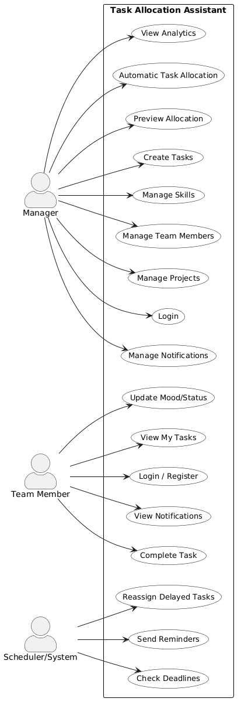
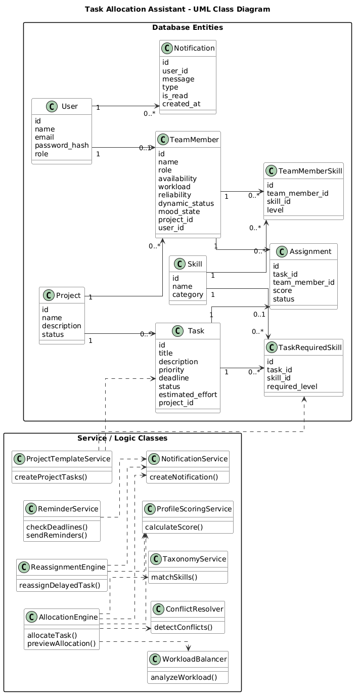
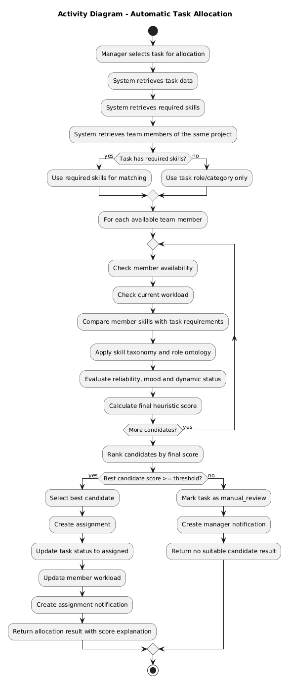
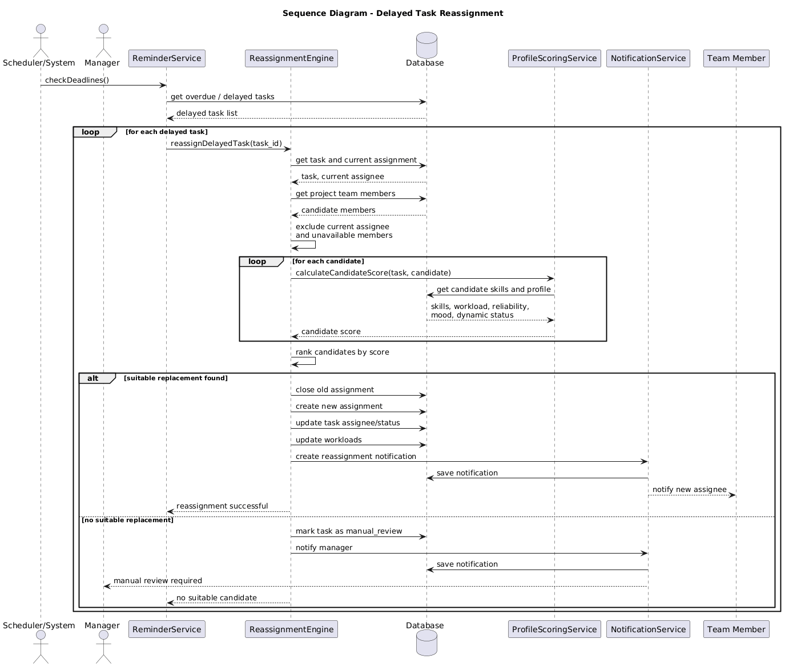
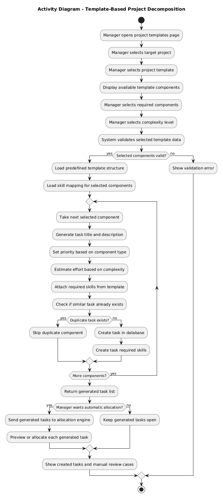
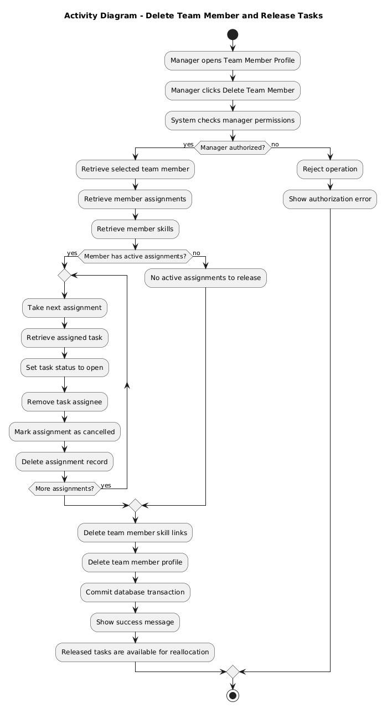
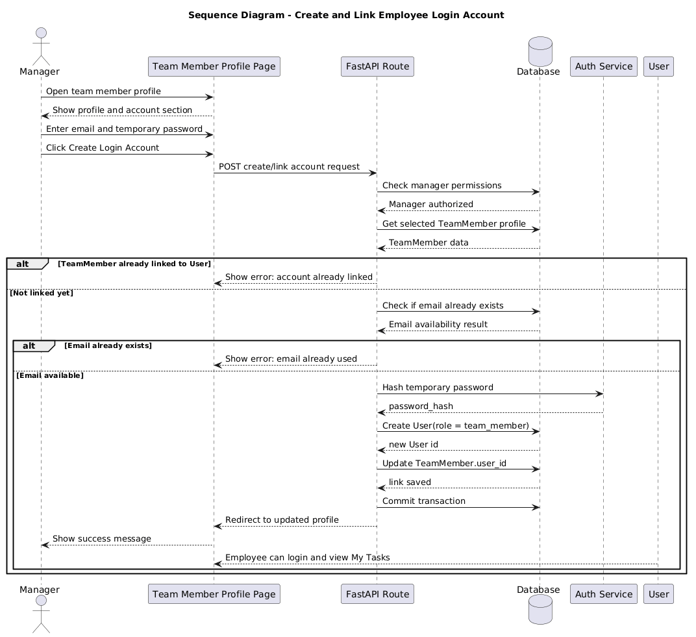

# UML Diagrams

## 1. Purpose

This document presents the main UML diagrams for the project **Task Allocation Assistant for Team and Project Management**.

The diagrams support the Software Engineering report by showing:

- the main users of the system;
- the structure of the main entities;
- the most important workflows;
- the algorithmically complex parts of the project.

The project is not a simple task tracker. It is a rule-based decision-support system for task allocation. Therefore, the most important diagrams are the ones that explain automatic allocation, template-based project decomposition, delayed task reassignment, and related workflows.

---

## 2. Included Diagrams

The project documentation includes the following UML diagrams:

1. Use Case Diagram
2. Class Diagram
3. Activity Diagram: Automatic Task Allocation
4. Sequence Diagram: Delayed Task Reassignment
5. Activity Diagram: Template-Based Project Decomposition
6. Activity Diagram: Delete Team Member and Release Tasks
7. Sequence Diagram: Create and Link Employee Login Account

---

## 3. Use Case Diagram

The Use Case Diagram shows the main interactions between the users and the system.

It includes three main actors:

- Manager;
- Team Member;
- Scheduler/System.

The diagram shows that the manager can manage projects, team members, skills, tasks, allocations, analytics, and notifications. Team members can view their tasks, update mood/status, complete tasks, and view notifications. The scheduler/system checks deadlines, sends reminders, and triggers delayed task reassignment.

---

## 4. Class Diagram

The Class Diagram shows the main database entities and service/logic classes of the system.

It includes the main entities:

- User;
- Project;
- TeamMember;
- Skill;
- TeamMemberSkill;
- Task;
- TaskRequiredSkill;
- Assignment;
- Notification.

It also shows the main logic services:

- AllocationEngine;
- ProfileScoringService;
- TaxonomyService;
- WorkloadBalancer;
- ConflictResolver;
- ReassignmentEngine;
- NotificationService;
- ReminderService;
- ProjectTemplateService.

This diagram is important because it shows both the database-oriented part of the project and the service classes responsible for complex application logic.

---

## 5. Activity Diagram: Automatic Task Allocation

This Activity Diagram describes the workflow used when the system automatically assigns a task to the most suitable team member.

The workflow includes:

- retrieving task data;
- retrieving required skills;
- retrieving team members from the same project;
- checking availability and workload;
- comparing skills with task requirements;
- applying skill taxonomy and role ontology;
- evaluating reliability, mood, and dynamic status;
- calculating the final heuristic score;
- ranking candidates;
- assigning the task or moving it to manual review.

This diagram demonstrates that automatic task allocation is not a simple CRUD operation. It is a multi-step rule-based decision workflow.

---

## 6. Sequence Diagram: Delayed Task Reassignment

This Sequence Diagram shows how the system reassigns a delayed task to another suitable team member.

The workflow includes:

- checking delayed tasks;
- retrieving the current assignment;
- excluding the current assignee;
- evaluating alternative candidates;
- calculating candidate scores;
- selecting a replacement;
- updating assignments and workloads;
- creating notifications.

If no suitable replacement is found, the task is moved to manual review.

---

## 7. Activity Diagram: Template-Based Project Decomposition

This Activity Diagram describes how the system generates multiple tasks from a predefined project template.

The workflow includes:

- selecting a project;
- selecting a project template;
- selecting components;
- selecting complexity;
- validating the template data;
- generating task titles and descriptions;
- assigning required skills;
- preventing duplicate tasks;
- optionally sending generated tasks to the allocation engine.

This diagram supports the complex functionality of structured project decomposition.

---

## 8. Activity Diagram: Delete Team Member and Release Tasks

This Activity Diagram shows how the system deletes a team member while preserving task consistency.

The workflow includes:

- checking manager permissions;
- retrieving the selected team member;
- retrieving active assignments;
- setting assigned tasks back to open;
- removing task assignees;
- deleting assignment records;
- deleting member skill links;
- deleting the team member profile.

This is more than a simple delete operation because assigned tasks are released and become available for reallocation.

---

## 9. Sequence Diagram: Create and Link Employee Login Account

This Sequence Diagram shows how a manager creates and links a login account for an existing team member profile.

The workflow includes:

- opening the team member profile;
- entering email and temporary password;
- checking manager permissions;
- checking whether the team member is already linked to a user account;
- checking email availability;
- hashing the temporary password;
- creating a user account with role `team_member`;
- updating `TeamMember.user_id`.

This diagram explains the difference between a `TeamMember` profile and a `User` login account.

---

## 10. Diagram-to-Requirement Mapping

| Diagram | Main Purpose | Requirement Supported |
|---|---|---|
| Use Case Diagram | Shows main system interactions | General system scope |
| Class Diagram | Shows entities, relationships, and services | DB structure and architecture |
| Activity Diagram: Automatic Task Allocation | Shows heuristic scoring workflow | Complex functionality |
| Sequence Diagram: Delayed Task Reassignment | Shows reassignment component interaction | Complex functionality |
| Activity Diagram: Template-Based Project Decomposition | Shows structured task generation workflow | Complex functionality |
| Activity Diagram: Delete Team Member and Release Tasks | Shows consistency-preserving delete workflow | DB logic / complex workflow |
| Sequence Diagram: Create and Link Employee Login Account | Shows account creation and profile linking | Authentication / DB workflow |

---

## 11. Conclusion

These diagrams document the main structure and workflows of the system.

They show that the project includes:

- database-oriented functionality;
- user and project management;
- structured team-member profiles;
- rule-based task allocation;
- workload and deadline monitoring;
- delayed task reassignment;
- template-based project decomposition;
- account/profile linking logic.

The most important diagrams for demonstrating algorithmic complexity are:

1. Activity Diagram: Automatic Task Allocation
2. Sequence Diagram: Delayed Task Reassignment
3. Activity Diagram: Template-Based Project Decomposition

Together, they show that the project contains meaningful rule-based application logic beyond simple CRUD functionality.